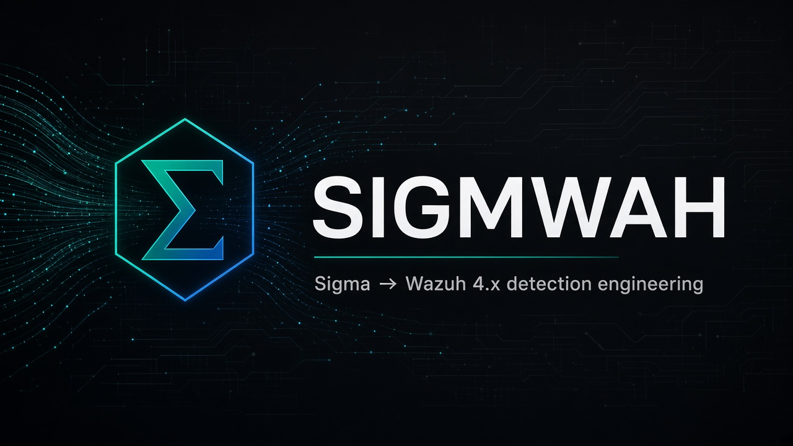
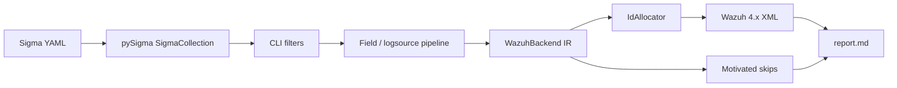

<p align="center">
  
</p>

<p align="center">
  
</p>

<h1 align="center">Sigmwah</h1>

<p align="center">
  <strong>Sigma → Wazuh 4.x XML</strong><br>
  pySigma backend + batch CLI for detection engineering on Wazuh <code>analysisd</code>
</p>

<p align="center">
  
  
  
  
  
  
</p>

<p align="center">
  <a href="#quick-start">Quick start</a> ·
  <a href="#how-it-works">How it works</a> ·
  <a href="#cli-reference">CLI</a> ·
  <a href="#what-converts">Coverage</a> ·
  <a href="#load-on-a-wazuh-manager">Deploy</a> ·
  <a href="#documentation">Docs</a>
</p>

---

**Community project.** Sigmwah is **not** affiliated with, endorsed by, or sponsored by Wazuh Inc. or SigmaHQ. Wazuh is a trademark of Wazuh Inc.

Sigmwah converts [Sigma](https://github.com/SigmaHQ/sigma) detection rules into [Wazuh](https://wazuh.com/) **4.x** `analysisd` XML. It is written against current **pySigma** (not the deprecated `sigmac` toolchain). SigmaHQ rules are **downloaded** when you ask — they are never vendored in this package.

| You have | Sigmwah gives you |
| --- | --- |
| Sigma YAML (your own, or a SigmaHQ release zip) | Wazuh 4.x XML under custom IDs `100100–119999` |
| Filters (`product`, tags, level) | A subset ready for a channel / logsource |
| Constructs Wazuh cannot express | A **skip** in `report.md`, not a silent wrong rule |

---

## Quick start

Requires Python 3.11 or 3.12.

```bash
git clone <this-repository>
cd sigmwah
python3 -m venv .venv
source .venv/bin/activate   # Windows: .venv\Scripts\activate
pip install -e ".[dev]"
```

Download the official SigmaHQ release (Detection Rule License 1.1) and convert Windows process-creation / Sysmon-style rules:

```bash
sigmwah download-sigmahq --version latest --dest ./sigmahq
sigmwah convert ./sigmahq \
  --select product=windows \
  --level medium+ \
  -o rules_sigma.xml \
  --report report.md \
  --id-file .sigmwah_ids.json
```

Copy `rules_sigma.xml` to the manager (`/var/ossec/etc/rules/`), restart `wazuh-manager`, and keep `.sigmwah_ids.json` with the ruleset so reconversion does not reshuffle IDs.

**Five-minute lab (one synthetic rule):**

```bash
sigmwah convert tests/golden/01_contains.yml -o demo.xml --id-file /tmp/sigmwah-ids.json
sigmwah validate demo.xml
```

---

## How it works

<p align="center">
  
</p>



Design choices that matter in production:

- **Live Windows EventChannel** uses `if_sid` / `if_group` (parent 60000 / channel 60001 / Sysmon `if_group`). `<decoded_as>json</decoded_as>` does **not** fire on real agent events.
- Wazuh ANDs every child of a `<rule>`. Cross-field **OR** is expanded to DNF (one XML rule per branch). Same-field OR becomes a PCRE2 alternation.
- Custom IDs stay in **100100–119999** by default (Wazuh reserved range is 0–99999).
- `--target wazuh5` emits **experimental YAML** for the 5.x engine. It never quietly writes 4.x XML.

---

## CLI reference

```text
sigmwah --version
sigmwah convert PATH... [options]
sigmwah download-sigmahq [--version latest] [--dest ./sigmahq]
sigmwah validate RULES.xml [--docker] [--event LINE]
sigmwah ids [--id-file .sigmwah_ids.json] [--csv allocations.csv]
```

### `convert`

| Flag | Meaning |
| --- | --- |
| `-o`, `--output` | File or directory for XML (or YAML if `--target wazuh5`) |
| `--target wazuh4\|wazuh5` | Quality gate is **wazuh4** (default) |
| `--id-start` / `--id-max` | Custom SID range (default `100100`–`119999`) |
| `--id-file` | Persistent map Sigma id → Wazuh SID (`.sigmwah_ids.json`) |
| `--select product=windows` | Keep matching logsource fields (`product`, `category`, `service`) |
| `--tags` / `--exclude-tags` | Comma-separated Sigma tags, applied **before** conversion |
| `--level medium+` | Minimum Sigma level (`informational` … `critical`, optional `+`) |
| `--format single\|per-rule\|per-group` | One file, one file per Sigma rule, or split by Wazuh group |
| `--mappings custom.yaml` | Overlay / extend built-in field and logsource maps |
| `--dry-run` | Convert and report without writing XML |
| `--strict` | Non-zero exit if anything was skipped |
| `--fp-ignore` | Keep false-positive notes in comments (warns when they are not machine-excludable) |
| `--report report.md` | Conversion summary (converted / skipped / warnings) |

```bash
# Linux sshd only
sigmwah convert ./sigmahq --select product=linux,service=sshd -o sshd.xml

# Dry-run a mapping overlay
sigmwah convert ./rules --mappings overlay.yaml --dry-run --report report.md

# Experimental Wazuh 5 YAML (not XML)
sigmwah convert ./rules --target wazuh5 -o wazuh5.yaml
```

### `download-sigmahq`

Fetches the GitHub release zip, extracts it, and writes `SIGMWAH_DRL_NOTICE.txt`. License files from the vendor tree are preserved. **Do not commit that tree back into Sigmwah.**

### `validate`

Well-formed XML, unique IDs, `level` + `description`, group-name comma convention. `--docker` starts `wazuh/wazuh-manager:4.14.7` and runs `wazuh-logtest` on **synthetic** `--event` lines. The container may patch rule 60000 for logtest only; emitted rulesets are never patched.

### `ids`

Lists allocated SIDs. `--csv` exports the map for change control.

---

## What converts

**Converted**

- Field matches: exact, `contains`, `contains\|all`, `startswith` / `endswith`, `re`, wildcards, `base64` (via pySigma)
- Windows EventChannel + Sysmon via `if_sid` / `if_group`
- Linux sshd / auth / auditd and web / proxy / firewall `program_name` entry
- MITRE `attack.tXXXX` tags → `<mitre><id>TXXXX</id></mitre>`
- Sigma 2.0 `event_count` → `frequency` + `timeframe` + `if_matched_sid` / `if_matched_group`
- `group-by` on mapped user / srcip → `same_user` / `same_source_ip` / `same_field` when Wazuh can express it

**Skipped with a reason (never guessed)**

- `value_count`, ordered / extended temporal correlation
- Numeric `lt` / `gt` / `gte` field compares, field-to-field equals
- Anything else with no honest `analysisd` equivalent

Read the mapping tables in [`docs/mappings.md`](docs/mappings.md).

---

## Load on a Wazuh manager

1. Convert on a workstation (keep `.sigmwah_ids.json` in git or a secrets store).
2. Install XML under `/var/ossec/etc/rules/` (a name that sorts last, e.g. `zzz_sigma_rules.xml`, if you chain `if_sid`).
3. `chown wazuh:wazuh` · `chmod 640` · `systemctl restart wazuh-manager`.
4. Grep `/var/ossec/logs/ossec.log` for rule load errors.

Full runbook, including the **wazuh-logtest** EventChannel caveat: [`docs/runbook.md`](docs/runbook.md).

---

## Example

Synthetic Sigma (not copied from SigmaHQ):

```yaml
title: Synthetic PowerShell Image
id: 11111111-1111-4111-8111-111111111111
logsource:
  category: process_creation
  product: windows
detection:
  selection:
    Image|contains: powershell
  condition: selection
level: medium
tags:
  - attack.t1059.001
```

Abbreviated Wazuh 4.x output:

```xml
<group name="sigma,windows,sysmon,">
  <rule id="100100" level="6">
    <!-- Sigma title: … | Converted with Sigmwah from SigmaHQ (DRL 1.1) -->
    <if_group>sysmon_event1</if_group>
    <field name="win.eventdata.image" type="pcre2">(?i).*powershell.*</field>
    <options>no_full_log</options>
    <description>Synthetic PowerShell Image</description>
    <mitre><id>T1059.001</id></mitre>
  </rule>
</group>
```

More samples: [`docs/examples.md`](docs/examples.md) and `tests/golden/`.

---

## Project layout

```text
src/sigmwah/           CLI, backend, emitter, mappings YAML
src/sigma/backends/    pySigma plugin: backends = {"wazuh": WazuhBackend}
tests/golden/          original YAML + expected XML
docs/                  mappings, runbook, examples
```

```bash
ruff check src tests
mypy src/sigmwah
pytest -m "not docker"    # coverage gate ≥ 85%
```

CI: GitHub Actions on Python 3.11 and 3.12 (`.github/workflows/ci.yml`).

---

## License and attribution

| Piece | License |
| --- | --- |
| Sigmwah source | [Apache License 2.0](LICENSE) |
| pySigma (pip dependency, not vendored) | LGPL-2.1-only |
| SigmaHQ rules you download | [DRL 1.1](https://github.com/SigmaHQ/Detection-Rule-License) |

Every converted `<rule>` includes Sigma title, id, author, date, references, and:

`Converted with Sigmwah from SigmaHQ (DRL 1.1)`

See [NOTICE](NOTICE).

---

## Documentation

| Doc | Contents |
| --- | --- |
| [docs/mappings.md](docs/mappings.md) | `if_sid` / `if_group`, field names, modifiers, correlation |
| [docs/runbook.md](docs/runbook.md) | Install XML on the manager, logtest notes |
| [docs/examples.md](docs/examples.md) | Input / output and mapping overlays |
| [CONTRIBUTING.md](CONTRIBUTING.md) | Dev setup and review bar |
| [SECURITY.md](SECURITY.md) | How to report issues |
| [CHANGELOG.md](CHANGELOG.md) | 0.1.0 |

---

## Status

**0.1.0** — usable converter with tests, golden files, and documented Windows/Linux/web mappings verified against Wazuh **4.14.7**. Treat a first production rollout as a conversion campaign: inspect `report.md`, load XML in a lab, and confirm `if_sid` / `if_group` on your patch level before wide deployment.
