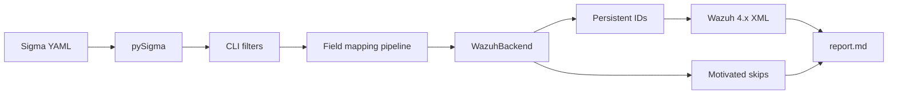

<p align="center">
  
</p>

<p align="center">
  
</p>

<h1 align="center">Sigmwah</h1>

<p align="center">
  <strong>Sigma → Wazuh 4.x XML</strong> for SIEM detection engineering.<br>
  pySigma backend + CLI. Original Apache-2.0 software. No guessed rules.
</p>

<p align="center">
  <a href="https://github.com/Franski6325/sigmwah/actions/workflows/ci.yml"></a>
  <a href="https://github.com/Franski6325/sigmwah/stargazers"></a>
  <a href="https://github.com/Franski6325/sigmwah/issues"></a>
  
  
  
  
  
</p>

<p align="center">
  <a href="https://github.com/topics/sigma"></a>
  <a href="https://github.com/topics/wazuh"></a>
  <a href="https://github.com/topics/pysigma"></a>
  <a href="https://github.com/topics/siem"></a>
  <a href="https://github.com/topics/detection-engineering"></a>
  <a href="https://github.com/topics/cybersecurity"></a>
  <a href="https://github.com/topics/python"></a>
  <a href="https://github.com/topics/threat-detection"></a>
  <a href="https://github.com/topics/mitre-attack"></a>
  <a href="https://github.com/topics/dfir"></a>
  <a href="https://github.com/topics/soc"></a>
</p>

<p align="center">
  
</p>

<p align="center">
  <a href="#why-sigmwah">Why</a>
  · <a href="#quick-start">Quick start</a>
  · <a href="#how-it-works">How it works</a>
  · <a href="#cli">CLI</a>
  · <a href="#what-converts-and-what-does-not">Coverage</a>
  · <a href="#load-rules-on-wazuh">Deploy</a>
  · <a href="#legal">Legal</a>
  · <a href="#in-italiano">Italiano</a>
</p>

---

**Community software.** Sigmwah is **not** affiliated with, endorsed by, or sponsored by [Wazuh Inc.](https://wazuh.com/) or [SigmaHQ](https://github.com/SigmaHQ). “Wazuh” is a trademark of Wazuh Inc. Sigma is a SigmaHQ project.

Sigmwah reads **Sigma YAML** (your files, or a SigmaHQ release you download yourself) and writes **Wazuh 4.x `analysisd` XML**. It talks to [pySigma](https://github.com/SigmaHQ/pySigma) over the public API. It does **not** use `sigmac`. It does **not** ship SigmaHQ rule text in this repository.

| You bring | You get |
| --- | --- |
| Sigma YAML | Custom Wazuh rules in SID range **100100–119999** |
| Optional filters (`product`, tags, level) | Only the slice you asked for |
| A construct Wazuh cannot express | A **skip with a reason** in `report.md` — never a silent wrong rule |

---

## Why Sigmwah

Sigma’s old converter stack (`sigmac`) is retired. Current rules go through **pySigma**. Wazuh 4.x still consumes XML. Sigmwah is the missing piece for that pair, written from scratch for this repository.

It is opinionated on purpose:

- Live Windows EventChannel matches use **`if_sid` / `if_group`**, not production `<decoded_as>json</decoded_as>` (that decoder path does not fire on real agent events).
- Cross-field **OR** becomes DNF (one `<rule>` per branch). Same-field OR becomes one PCRE2 alternation. Wazuh ANDs every child of a rule; we do not pretend otherwise.
- `--target wazuh5` emits **experimental YAML** for the 5.x engine. It never quietly emits 4.x XML.

Quality gate for 0.1.0: Wazuh **4.14.7**, Python **3.11 / 3.12**, unit + golden tests, coverage **≥ 85%**.

---

## Quick start

```bash
git clone https://github.com/Franski6325/sigmwah.git
cd sigmwah
python3 -m venv .venv
source .venv/bin/activate          # Windows: .venv\Scripts\activate
pip install -e ".[dev]"
```

**Lab (synthetic rule, no SigmaHQ download):**

```bash
sigmwah convert tests/golden/01_contains.yml -o demo.xml --id-file /tmp/sigmwah-ids.json
sigmwah validate demo.xml
```

**Catalog you downloaded (Detection Rule License 1.1 stays with that tree):**

```bash
sigmwah download-sigmahq --version latest --dest ./sigmahq
sigmwah convert ./sigmahq \
  --select product=windows \
  --level medium+ \
  -o rules_sigma.xml \
  --report report.md \
  --id-file .sigmwah_ids.json
```

Keep `.sigmwah_ids.json` next to the XML. Reconversion reuses the same Wazuh SIDs.

---

## How it works

<p align="center">
  
</p>



---

## CLI

```text
sigmwah --version
sigmwah convert PATH... [options]
sigmwah download-sigmahq [--version latest] [--dest ./sigmahq]
sigmwah validate RULES.xml [--docker] [--event LINE]
sigmwah ids [--id-file .sigmwah_ids.json] [--csv allocations.csv]
```

<details>
<summary><strong>convert — flags</strong></summary>

| Flag | Meaning |
| --- | --- |
| `-o`, `--output` | XML file or directory (YAML if `--target wazuh5`) |
| `--target wazuh4\|wazuh5` | Default **wazuh4** (the supported engine) |
| `--id-start` / `--id-max` | Custom SID range (default `100100`–`119999`) |
| `--id-file` | Persistent Sigma id → Wazuh SID map |
| `--select product=windows` | Logsource filter (`product`, `category`, `service`) |
| `--tags` / `--exclude-tags` | Comma-separated tags, applied **before** conversion |
| `--level medium+` | Minimum Sigma level |
| `--format single\|per-rule\|per-group` | One file, per Sigma rule, or per Wazuh group |
| `--mappings custom.yaml` | Overlay on built-in field / logsource maps |
| `--dry-run` | Convert and report without writing files |
| `--strict` | Exit non-zero if anything was skipped |
| `--fp-ignore` | Keep false-positive notes in XML comments |
| `--report report.md` | Converted / skipped / warnings |

</details>

```bash
sigmwah convert ./sigmahq --select product=linux,service=sshd -o sshd.xml
sigmwah convert ./rules --mappings overlay.yaml --dry-run --report report.md
sigmwah convert ./rules --target wazuh5 -o wazuh5.yaml
```

**`download-sigmahq`** fetches the official GitHub release zip and writes `SIGMWAH_DRL_NOTICE.txt`. Do not commit that tree here.

**`validate`** checks well-formed XML, unique IDs, `level`, `description`. `--docker` runs synthetic `--event` lines through `wazuh/wazuh-manager:4.14.7` / `wazuh-logtest`. Any logtest patch to rule 60000 stays **inside the container**.

**`ids`** lists allocated SIDs; `--csv` is for change control.

---

## What converts, and what does not

**Converted**

- Field matches: exact, `contains`, `contains|all`, `startswith` / `endswith`, `re`, wildcards, `base64` (via pySigma)
- Windows EventChannel + Sysmon via `if_sid` / `if_group`
- Linux sshd / auth / auditd and web / proxy / firewall `program_name` entry
- MITRE `attack.tXXXX` → `<mitre><id>TXXXX</id></mitre>`
- Sigma 2.0 `event_count` → `frequency` + `timeframe` + `if_matched_sid` / `if_matched_group`
- `group-by` on mapped user / srcip → `same_user` / `same_source_ip` / `same_field` when Wazuh can say it

**Skipped with a reason**

- `value_count`, ordered / extended temporal correlation
- Numeric `lt` / `gt` / `gte`, field-to-field equals
- Anything else with no honest `analysisd` equivalent

Tables: [`docs/mappings.md`](docs/mappings.md).

---

## Load rules on Wazuh

1. Convert on a workstation. Version `.sigmwah_ids.json` with the XML.
2. Install under `/var/ossec/etc/rules/` (a late-sorting name such as `zzz_sigma_rules.xml` if you chain `if_sid`).
3. `chown wazuh:wazuh` · `chmod 640` · `systemctl restart wazuh-manager`.
4. Check `/var/ossec/logs/ossec.log` for load errors.

Runbook (including wazuh-logtest vs live EventChannel): [`docs/runbook.md`](docs/runbook.md).

---

## Example

Synthetic Sigma written for this repo (not taken from SigmaHQ):

```yaml
title: Synthetic PowerShell Image
id: 11111111-1111-4111-8111-111111111111
logsource:
  category: process_creation
  product: windows
detection:
  selection:
    Image|contains: powershell
  condition: selection
level: medium
tags:
  - attack.t1059.001
```

Abbreviated Wazuh 4.x output:

```xml
<group name="sigma,windows,sysmon,">
  <rule id="100100" level="6">
    <!-- Sigma title: … | Converted with Sigmwah from SigmaHQ (DRL 1.1) -->
    <if_group>sysmon_event1</if_group>
    <field name="win.eventdata.image" type="pcre2">(?i).*powershell.*</field>
    <options>no_full_log</options>
    <description>Synthetic PowerShell Image</description>
    <mitre><id>T1059.001</id></mitre>
  </rule>
</group>
```

More: [`docs/examples.md`](docs/examples.md), `tests/golden/`.

---

## Develop

```text
src/sigmwah/           converter, CLI, mapping YAML
src/sigma/backends/    pySigma plugin discovery
tests/golden/          original YAML + expected XML
docs/                  mappings, runbook, examples
```

```bash
ruff check src tests
mypy src/sigmwah
pytest -m "not docker"
```

CI: [`.github/workflows/ci.yml`](.github/workflows/ci.yml). See [CONTRIBUTING.md](CONTRIBUTING.md).

---

## Legal

| Piece | Terms |
| --- | --- |
| Sigmwah source in this repository | [Apache License 2.0](LICENSE) — written for this project, not copied from other converters |
| pySigma (installed with pip, **not** vendored) | LGPL-2.1-only |
| SigmaHQ rules **you** download | [Detection Rule License 1.1](https://github.com/SigmaHQ/Detection-Rule-License) |

This tree does **not** contain SigmaHQ detection YAML. Golden tests are original. Converter implementations such as sigmac, sigma2wazuh, and cookiecutter pySigma backends were **not** used as source.

Every converted `<rule>` carries Sigma title, id, author, date, references, and:

`Converted with Sigmwah from SigmaHQ (DRL 1.1)`

Full third-party notes: [NOTICE](NOTICE). Security contact: [SECURITY.md](SECURITY.md).

---

## Docs

| Doc | Contents |
| --- | --- |
| [docs/mappings.md](docs/mappings.md) | `if_sid` / `if_group`, fields, modifiers, correlation |
| [docs/runbook.md](docs/runbook.md) | Install XML on a 4.x manager |
| [docs/examples.md](docs/examples.md) | Overlay mappings |
| [CHANGELOG.md](CHANGELOG.md) | 0.1.0 |

**0.1.0** is a first public converter, not a turnkey SOC platform. Convert, read `report.md`, load XML in a lab, and confirm `if_sid` / `if_group` on your Wazuh patch before wide deployment.

Repository: [github.com/Franski6325/sigmwah](https://github.com/Franski6325/sigmwah)

---

## In italiano

Sigmwah converte regole di detection **Sigma** (YAML, tramite pySigma) in regole XML **Wazuh 4.x** (`analysisd`). Non è affiliato a Wazuh Inc. né a SigmaHQ. Le regole SigmaHQ non stanno in questo repo: le scarichi tu, restano sotto DRL 1.1.

Cosa fa bene: match su campi, Windows EventChannel/Sysmon con `if_sid`/`if_group`, Linux/web, correlazione `event_count`, ID persistenti. Cosa non inventa: correlazioni che Wazuh non sa esprimere — finiscono nel report come scarti motivati.

```bash
git clone https://github.com/Franski6325/sigmwah.git
cd sigmwah && pip install -e ".[dev]"
sigmwah convert tests/golden/01_contains.yml -o demo.xml --id-file /tmp/ids.json
```
